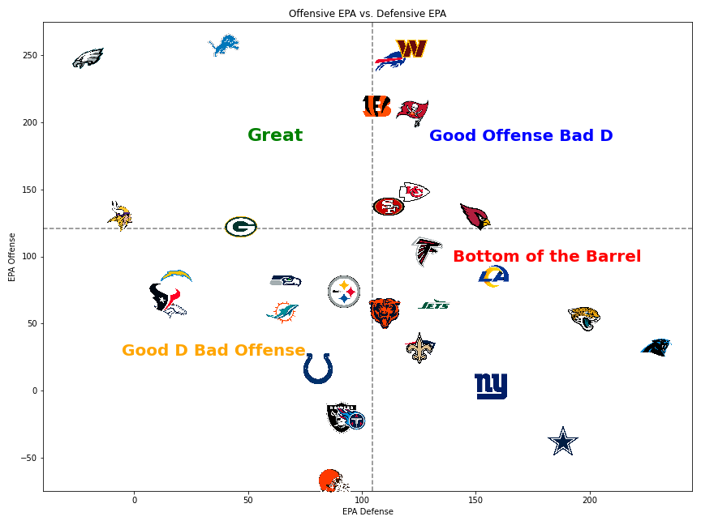
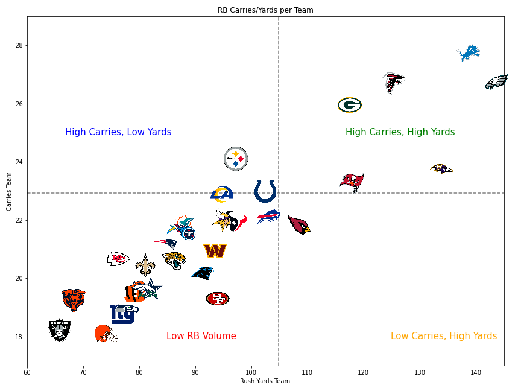

# NFL_2024_Advanced_Stats
This repository contains models, tools, and analyses designed to predict and evaluate NFL game outcomes, team performance, and player statistics for the 2024 season. Below is an overview of the key files and functionalities:

---

## **Files Overview**

### 1. **`NFL_Official_Model_2024.ipynb`**
- Predicts the outcomes of every NFL game for the 2024 season.
- Utilizes advanced statistical modeling and historical data to forecast results.

### 2. **`EPA_d_o.ipynb`**
- Tracks the **Expected Points Added (EPA)** for each team's **offense** and **defense**.
- Includes visualizations that graph offensive and defensive EPA against one another for comparative analysis.
- Example visualization: 

### 3. **`rb_team_stats.ipynb`**
- Tracks **running back stats** for each team.
- Analyzes how teams perform **against the run**, providing insights into rushing efficiency and defense.
- Example visualization: 

### 4. **`wr_model-test-Copy1.ipynb`**
- Creates a **predictive model for wide receivers (WRs)** and their expected performance each week.
- Accounts for factors like matchups, target shares, and defensive schemes.

### 5. **`nfl_first_score.ipynb`**
- Analyzes data from all years prior to 2024 to study **first scoring events** in NFL games.
- Provides insights into how often the **first score** is a **touchdown** versus other outcomes (e.g., field goals, safeties).

---

## **Features**
- Comprehensive predictive models tailored for the 2024 NFL season.
- Tools for evaluating team and player performance across multiple dimensions.
- Visualization and analysis of key metrics like EPA, rushing stats, and WR performance.
- Historical analysis of scoring trends to better understand team tendencies.

---

## **How to Use**
1. Clone this repository:
   ```bash
   git clone <repository_url>
   ```
2. Navigate to the repository directory:
   ```bash
   cd <repository_name>
   ```
3. Open the desired Jupyter notebook using:
   ```bash
   jupyter notebook <filename>.ipynb
   ```
4. Follow the instructions in each notebook to run the analyses and models.

---

## **Planned Enhancements**
- Extend models to include postseason games.
- Refine player-specific predictive models to incorporate injury data.
- Add visualization tools for exploring team tendencies over time.

---
